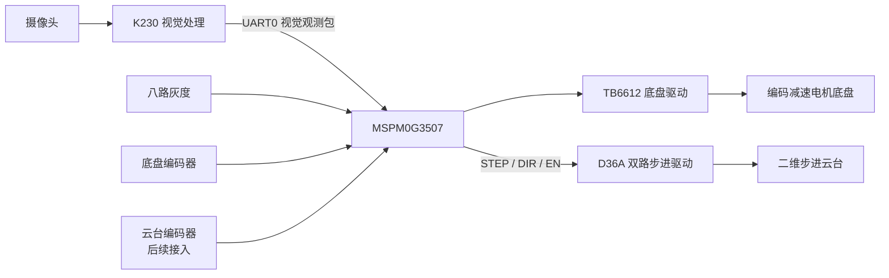

# nuedc_e_car_mspm0

本工程是基于 TI MSPM0G3507、Keil MDK、MSPM0 SDK、SysConfig 和 MSPM0 DriverLib 的电赛 E 题自动寻迹小车工程。当前阶段优先适配新版 IO 并做板级外设验证，不默认上车完整循迹。

---

## 方案B：K230 视觉 + MSPM0 运动控制架构

本章面向控制组和 K230 视觉组共同开发。以下所有内容为方案 B 的设计草案，**只有明确标注"已实现"的条目才是当前代码中已完成的**。

### 项目范围

当前项目针对 **2025 年电赛 E 题** 开发。

**底盘任务**（当前已实现）：
- 使用两轮差速编码减速电机；
- 使用八路灰度模块循迹；
- 完成约 1m × 1m 正方形路线循迹；
- 使用轮端编码器进行速度和距离计算；
- 当前不依赖 MPU6050 完成转向；
- 当前不使用 NRF24L01；
- 当前不使用舵机。

**云台任务**（计划开发 / 正在开发）：
- 使用两台 MS42CG 编码步进电机；
- 通过 D36A 双路步进驱动板控制；
- 分别作为二维云台 X 轴和 Y 轴；
- 最终由 MSPM0 完成 STEP、DIR、轨迹规划、编码器反馈和安全控制。

**视觉任务**（K230 负责）：
- K230 识别矩形目标；
- K230 识别激光点；
- K230 计算并输出视觉观测；
- **K230 不直接决定最终 STEP 频率**；
- **K230 不直接控制 D36A**；
- **K230 不承担最终电机闭环**。

### 系统框图



完整控制链路：

```
摄像头 → K230 图像识别 → UART 发送视觉观测 → MSPM0 解析最新观测
→ 视觉外环 → 轨迹规划 → 云台电机控制 → STEP/DIR 输出 → 云台运动
→ 摄像头观察新的结果
```

底盘循迹和云台控制都由 MSPM0 执行，但两者在软件中保持模块化。

### 职责划分

| 功能 | K230 | MSPM0 |
| --- | --- | --- |
| 摄像头采集 | **负责** | 不负责 |
| 矩形检测 | **负责** | 不负责 |
| 激光点检测 | **负责** | 不负责 |
| 视觉目标锁定 | **负责** | 使用其结果 |
| 坐标有效性 | **负责**判断并发送 | 负责复核超时 |
| 置信度 | **负责**计算并发送 | 用于控制降级 |
| 图像时间戳 | **负责**发送 | 用于判断数据年龄 |
| 视觉误差计算 | 可发送原始坐标，**最终由 MSPM0 计算** | **负责** |
| 云台轨迹规划 | 不负责 | **负责** |
| STEP 频率 | 不负责 | **负责** |
| DIR 和 EN | 不负责 | **负责** |
| 云台编码器 | 不负责 | **负责** |
| 堵转和丢步保护 | 不负责 | **负责** |
| 正方形循迹 | 不负责 | **负责** |
| 底盘速度闭环 | 不负责 | **负责** |
| K230 通信超时停车 | 不负责 | **负责** |

**核心原则：K230 发送的是"观测"，不是"电机命令"。**

**禁止 K230 向 MSPM0 发送以下内容作为最终控制量**：
- X 轴最终 STEP 频率；
- Y 轴最终 STEP 频率；
- DIR 最终电平；
- EN 最终电平；
- 虚拟电机位置；
- 软件限位结果；
- 电机 PID 输出。

**K230 可以发送**：
- 矩形中心坐标；
- 激光点坐标；
- 检测有效标志；
- 置信度；
- 锁定状态；
- 图像帧序号；
- 图像采样时间；
- 图像处理耗时。

### 当前开发阶段

**阶段 1：MSPM0 双轴 STEP 开环测试**（当前阶段，代码已编译但**尚未通过实机验证**）

当前验证内容：
- MSPM0 能独立驱动两个步进电机；
- X、Y 两轴分别输出有限数量的 STEP 脉冲；
- K1 触发 X 轴转动 45°；
- K2 触发 Y 轴转动 45°；
- K3 立即停止两个轴；
- 当前不读取云台编码器；
- 当前不接入 K230 视觉控制；
- 正方形基础循迹代码继续保留。

计划参数：
- 步进电机整步数：200 step/rev；
- 驱动细分：16；
- 每圈脉冲数：3200；
- 45° 对应 400 个 STEP 脉冲；
- 初始测试频率：500 Hz；
- STEP 占空比：50%。

**阶段 2：K230 视觉输出**（计划中）

K230 保留：
- 矩形识别；
- 激光点识别；
- 目标锁定；
- 丢失和重捕获；
- 坐标滤波；
- UART 数据发送。

K230 移除或禁用：
- D36A STEP 输出；
- D36A DIR 输出；
- 步进 Ramp；
- 步进虚拟位置；
- 基于虚拟步数的软件限位；
- 最终云台 PD 电机输出。

当前已有 K230 直接控制云台的代码可以保留为 legacy 测试版本，不要直接删除。正式方案应新建或切换到 `vision_uart` 模式。

**阶段 3：UART 联调**（计划中）
- K230 周期发送视觉观测；
- MSPM0 只接收、校验、记录帧序号和延迟；
- 暂时不驱动云台；
- 验证丢包、错包、CRC 和超时。

**阶段 4：视觉开环控制**（计划中）
- MSPM0 根据视觉误差控制 STEP；
- 暂时不使用云台编码器修正；
- 验证方向、速度、死区和限位。

**阶段 5：编码器闭环**（计划中，后续接入 MS42CG）
- PWM 绝对角度；
- A/B 增量反馈；
- Z 相参考；
- 堵转检测；
- 丢步检测；
- 绝对位置限位。

---

## 通信接口

### 串口分配

| 通道 | MSPM0 引脚 | 用途 | 当前状态 |
| --- | --- | --- | --- |
| **UART0** | PA0 TX / PA1 RX | K230 正式视觉通信 | **计划启用** |
| **UART1** | PB6 TX / PB7 RX, 9600 8N1 | 蓝牙或有线调试 | **当前已使用** |
| **UART2** | PA23 TX / PA24 RX | 预留 | 未启用 |
| **UART3** | PB2 TX / PB3 RX | 预留 | 未启用 |

方案 B 正式通信建议：
- MSPM0 UART0：115200，8N1；
- K230 继续使用其 UART3；
- K230 UART3 TX 连接 MSPM0 PA1 / UART0_RX；
- K230 UART3 RX 连接 MSPM0 PA0 / UART0_TX；
- 两块板必须共地；
- 串口逻辑电平必须为 3.3V；
- UART1 调试通道与 UART0 视觉通道分离。

物理接线：

```
K230 UART3_TX  →  MSPM0 PA1 / UART0_RX
K230 UART3_RX  ←  MSPM0 PA0 / UART0_TX
K230 GND       ↔  MSPM0 GND
```

第一版即使只需要 K230 单向发送，也建议把 TX、RX 和 GND 都预留完整。

---

## 视觉观测协议 V0（草案）

> **本协议为方案 B 的初版接口草案，K230 和 MSPM0 两端必须共同确认后再冻结。**

采用**固定 24 字节二进制帧**：

| 偏移 | 长度 | 字段 | 类型 | 说明 |
| --- | --- | --- | --- | --- |
| 0 | 1 | header0 | uint8 | 固定 0xAA |
| 1 | 1 | header1 | uint8 | 固定 0x55 |
| 2 | 1 | version | uint8 | 当前 0x01 |
| 3 | 1 | msg_type | uint8 | 0x01 表示视觉观测 |
| 4 | 2 | sequence | uint16 LE | 每帧递增 |
| 6 | 4 | capture_ms | uint32 LE | 图像采样时间（ms） |
| 10 | 2 | rect_x | uint16 LE | 矩形中心 X |
| 12 | 2 | rect_y | uint16 LE | 矩形中心 Y |
| 14 | 2 | laser_x | uint16 LE | 激光点 X |
| 16 | 2 | laser_y | uint16 LE | 激光点 Y |
| 18 | 1 | valid_flags | uint8 | 有效状态位 |
| 19 | 1 | rect_confidence | uint8 | 0~255 |
| 20 | 1 | laser_confidence | uint8 | 0~255 |
| 21 | 1 | tracking_state | uint8 | 跟踪状态 |
| 22 | 2 | crc16 | uint16 LE | 对偏移 0~21 字节计算 |

**valid_flags**：

| 位 | 含义 |
| --- | --- |
| bit0 | rectangle_valid |
| bit1 | laser_valid |
| bit2 | target_locked |
| bit3 | measurement_fresh |
| bit4~7 | 保留，发送时置 0 |

**tracking_state**：

| 值 | 含义 |
| --- | --- |
| 0 | LOST |
| 1 | ACQUIRING |
| 2 | TRACKING |
| 3 | HOLD |
| 其他 | 保留 |

**坐标约定**：
- 统一使用 **640 × 480** 逻辑坐标系；
- X 范围 0~639，Y 范围 0~479；
- 左上角为原点，X 向右增大，Y 向下增大；
- K230 内部即使在 320 × 240 图像上识别，也应在发送前换算到 640 × 480 逻辑坐标。

**无效坐标规则**：
- 无效坐标发送 **0xFFFF**；
- **不能用 0 表示无效**；
- 坐标是否可用必须同时检查 valid_flags；
- MSPM0 只能使用最新且有效的观测；
- 不允许排队执行过时的视觉帧。

**CRC**：
- 建议 CRC-16/CCITT-FALSE；
- polynomial = 0x1021；
- init = 0xFFFF；
- refin = false；
- refout = false；
- xorout = 0x0000。

**字节序**：所有多字节整数使用 Little Endian。禁止直接发送 Python 字符串形式的列表作为正式协议。ASCII 调试帧可以保留，但不能和正式二进制协议混在同一串口流中。

### 时间与频率约定

以下为**设计目标**，非当前已实现状态：

**K230 目标**：
- 摄像头请求帧率可以高于实际输出率；
- 正式视觉观测初期目标为稳定 50~60 Hz；
- 允许实际范围约 30~90 Hz；
- 每完成一次有效视觉处理就发送一帧；
- 不需要为了兼容旧控制器而固定在 50 Hz；
- 发送帧必须携带 sequence 和 capture_ms。

**MSPM0 目标**：
- UART 接收中断只负责接收字节；
- 协议解析在前台完成；
- 只保存最新一帧有效观测；
- 云台控制任务目标周期 1 ms；
- 新视觉帧到达时更新外环；
- 两帧之间由轨迹规划继续运行；
- 视觉数据超时后必须减速停止。

**初版建议超时**（后续通过实测调整）：
- 小于 100 ms：正常使用；
- 100~300 ms：降级或保持；
- 超过 300 ms：云台目标速度归零。

---

## K230 开发要求

K230 正式视觉版本必须：

- 保留矩形和激光点检测。
- 保留目标身份锁定和重捕获。
- 每帧生成递增 sequence。
- 记录图像采样时间。
- 发送矩形中心和激光中心。
- 分别提供 rectangle_valid 和 laser_valid。
- 无效坐标使用 0xFFFF。
- 发送置信度。
- 使用固定长度二进制帧。
- 计算 CRC16。
- UART 发送不能阻塞图像主循环过长时间。
- 正式协议中**不发送 STEP 频率和 DIR**。
- 摄像头或识别异常时仍应发送 LOST 状态，而不是继续发送旧坐标。
- 不把上一帧坐标伪装成当前有效测量。
- 允许短时 HOLD，但必须通过 tracking_state 明确标记。
- 当前 K230 直接驱动 D36A 的版本作为备份保留，不作为方案 B 正式程序。

---

## MSPM0 开发要求

MSPM0 侧后续职责：

- UART0 RX 环形缓冲区。
- 固定长度帧解析。
- 帧头重同步。
- CRC 验证。
- sequence 重复和乱序检查。
- 视觉数据年龄检查。
- 只覆盖保存最新帧。
- 视觉外环。
- STEP / DIR / EN 输出。
- 轨迹规划。
- 云台编码器反馈。
- 软限位和机械安全。
- 堵转及丢步检测。
- K230 超时停车。
- 与底盘正方形循迹状态共享。

---

## 软件结构

| 目录 | 说明 |
| --- | --- |
| `User/` | 主入口与主循环 |
| `App/` | E 题状态机、循迹逻辑、串口命令、板级测试、步进测试 |
| `Control/` | PID、滤波、速度闭环 |
| `Hardware/` | MSPM0G3507 外设驱动封装 |
| `System/` | 系统节拍、定时器、调度 |
| `keil/` | Keil MDK 工程文件 |

板级逻辑名集中在 `Hardware/Board_Config.h`。如果 SysConfig 重新生成的宏名变化，优先在 `Board_Config.h` 中做映射，不要在 App 层散落 DriverLib 或寄存器调用。

---

## 原理图实际 IO 映射

以下为**最终原理图接线真值**。

### TB6612 电机驱动

| 信号 | 引脚 |
| --- | --- |
| PWMA | PA12 |
| PWMB | PA13 |
| AIN1 | PB17 |
| AIN2 | PB19 |
| BIN1 | PA16 |
| BIN2 | PB24 |
| STBY | 5V（常使能，不占用 MCU IO） |

STBY 当前直接接 5V，软件不能依赖 STBY 关断电机，只能通过 PWM=0 和方向脚安全状态停车。

### 底盘编码器

| 信号 | 引脚 | 说明 |
| --- | --- | --- |
| M1_A | PA26 | 左电机 A 相，中断输入 |
| M1_B | PA27 | 左电机 B 相，方向采样 |
| M2_A | PA14 | 右电机 A 相，中断输入 |
| M2_B | PA25 | 右电机 B 相，方向采样 |

当前默认编码器计数方式：
- A 相 GPIO 中断；
- 默认只统计 A 相上升沿；
- B 相只用于读取电平判断方向；
- `LEFT_ENCODER_DIR` / `RIGHT_ENCODER_DIR` 用于修正左右轮方向。

`ECAR_ENCODER_PULSE_PER_REV = 367.0f` 是在当前代码计数方式（A 相上升沿计数 + B 相判断方向）的条件下，实测得到的轮端每圈脉冲数。若以后改成 A 相双边沿或 AB 四倍频，必须重新实测该值，否则速度和距离都会算错。

### 八路灰度模块

| 信号 | 引脚 | 说明 |
| --- | --- | --- |
| AD0 | PB13 | 多路选择地址位 |
| AD1 | PB10 | 多路选择地址位 |
| AD2 | PB23 | 多路选择地址位 |
| OUT | PB01 | 灰度输出输入 |

灰度模块当前按 5V 供电记录。`GRAY_OUT` 进入 MSPM0 PB01 前，硬件必须已经通过分压或电平转换降到 3.3V 安全范围。软件无法把 5V GPIO 输入变安全，不能用代码掩盖硬件风险。`GRAY_OUT` 配置为无内部上下拉输入，由模块输出电平决定。

### 按键

| 按键 | 引脚 | 说明 |
| --- | --- | --- |
| K1 | **PB22** | 输入上拉，按下为 0 |
| K2 | **PA30** | 输入上拉，按下为 0 |
| K3 | PB27 | 输入上拉，按下为 0 |
| K4 | PB26 | 输入上拉，按下为 0 |

### I2C、OLED、蜂鸣器、LED

| 外设 | 映射 |
| --- | --- |
| I2C0 | PA31 SCL / PA28 SDA，MPU6050 六轴传感器 |
| OLED_H8_I2C | H8 1x8 排母前 4 针，GND / 3V3 / SCL(SKC) PB9 / SDA PB8；`ECAR_OLED_ENABLE` 默认关闭 |
| OLED_H8_SPI | 可选 H8 SPI 模式，SCL PB9 / SDA PB8 / RES PB10 / DC PB11 / CS PB14，默认关闭 |
| BEEP | PA07 |
| LED_USER | PB04，若串联电阻为 10k，亮度可能偏低 |

当前使用 4 针 IIC OLED，直接插在 H8 排母前 4 针时，代码默认 `BOARD_OLED_USE_H8_I2C = 1`，通过 PB9/PB8 软件 I2C 驱动。因此灰度 `GRAY_AD1` 和按键 K1/K2 正常可用（K1/K2 已移至 PB22/PA30）。若后续改用天猛星 H8 SPI OLED，`PB10` 会作为 OLED 复位脚并和 `GRAY_AD1` 冲突，`PB11/PB14` 会作为 OLED DC/CS。

### UART

| 通道 | TX | RX | 状态 |
| --- | --- | --- | --- |
| UART0 | PA0 | PA1 | 预留 K230 视觉通信 |
| UART1 | PB6 | PB7 | 当前调试串口，9600 8N1 |
| UART2 | PA23 | PA24 | 预留 |
| UART3 | PB2 | PB3 | 预留 |

HC-04 接线：

```text
HC-04 RX → TX1 / PB6
HC-04 TX → RX1 / PB7
HC-04 GND → MSPM0 GND
HC-04 VCC → 按模块要求供电
```

### 舵机 PWM（已废弃）

| 信号 | 引脚 | 状态 |
| --- | --- | --- |
| PWM0 | PA21 / TIMA0-C0 | 当前已改为 X STEP |
| PWM1 | PA22 / TIMA0-C1 | 未使用 |
| PWM2 | PA15 / TIMA0-C2 | 当前已改为 Y STEP |
| PWM3 | PA17 / TIMA0-C3 | 未使用 |

舵机电源应使用独立大电流供电，并与主控共地。舵机测试默认关闭，需要显式打开宏。

### 云台步进电机（第一阶段候选映射）

| 功能 | 候选引脚 | 状态 |
| --- | --- | --- |
| X STEP | PA21 / TIMA0_C0 | PA21 已确认支持 TIMA0_C0，**代码中已接入**（尚未实机验证） |
| X DIR | PB15 | 候选 GPIO，待确认实际接线 |
| X EN | PB18 | 预留，EN 有效电平待实测（当前 `GIMBAL_USE_ENABLE_GPIO=0`） |
| Y STEP | PA15 / TIMA1_C0 | PA15 已知支持 TIMA0_C2，**TIMA1_C0 已通过代码配置**（尚未实机验证） |
| Y DIR | PB16 | 候选 GPIO，待确认实际接线 |
| Y EN | PB25 | 预留，EN 有效电平待实测（当前 `GIMBAL_USE_ENABLE_GPIO=0`） |

**重要说明**：
- PA21 当前已知支持 TIMA0_C0 ✓；
- PA15 当前代码已证明支持 TIMA1_C0（IOMUX_PINCM37_PF_TIMA1_CCP0 在 mspm0g350x.h 中定义），但尚未通过实机验证；
- DIR 和 EN 引脚尚未出现在本次最终原理图 IO 清单中，因此只能标为候选；
- D36A EN 有效电平尚未完成实物验证。

---

## 当前代码与原理图差异

> **原理图为硬件接线真值。以下引脚在代码中仍与原理图不一致，在代码修正并实测前，不应声称这几路已经一致。**

| 引脚 | 当前代码配置 | 原理图实际接线 | 状态 |
| --- | --- | --- | --- |
| K1 | PB22 | PB22 | **已同步** |
| K2 | PA30 | PA30 | **已同步** |

历史差异（已修正）：
- K1 曾映射为 PB14，当前代码已改为 PB22；
- K2 曾映射为 PB11，当前代码已改为 PA30。

区分说明：
- "原理图实际接线" → 硬件焊接的物理连接；
- "当前代码配置" → `ti_msp_dl_config.h` + `Board_Config.h` 中的宏定义；
- "方案 B 建议映射" → 本 README 中的候选规划；
- "尚待 SysConfig 验证的候选映射" → 仅在代码中标注但未经过 SysConfig 重新生成验证的 IO。

---

## 底盘正方形循迹

### 后置循迹模块 / 反向车头模式

当前默认使用后置循迹模块：

```c
#define ECAR_REAR_LINE_SENSOR_MODE 1U   // 后置循迹模块布局，新车头方向相对原来反向
```

后置模式下：
- 原右轮映射为逻辑左轮，原左轮映射为逻辑右轮；
- 编码器左右互换；
- 电机方向和编码器方向符号同步调整；
- 循迹修正方向 `g_lineTurnSign` 和角点固定转向 `E_CAR_TURN_SIGN` 反号；
- 灰度逻辑顺序 `g_lineReverseOrderF` 置 1 以匹配新车头视角。

首次切换或重新布线后，必须架空车轮验证：
1. `Motor_SetPWM(+150, +150)` 是否驱动小车向新车头方向前进；
2. 手推小车向新车头方向时，`g_leftEncoderDelta` 和 `g_rightEncoderDelta` 是否都为正；
3. 将黑胶带置于灰度模块下方，从新车头方向看，黑线偏左时 `g_lineError` 应为负。

### 循迹状态机

E 题正方形赛道循迹逻辑：

1. 正常直线循迹：PD 循迹 + 自适应降速 + 大偏差限幅。
2. 角点判定：八路灰度全白（`g_lineBlackCount == 0 && g_lineMask == 0`），连续 `ECAR_CORNER_LOST_CONFIRM_MS`（100 ms）触发角点。
3. 第一个角点不要求直线距离；从第二个角点开始，当前边必须已行驶超过 `ECAR_CORNER_MIN_STRAIGHT_CM`（80 cm）。
4. 判定角点后继续直行 `ECAR_CORNER_ADVANCE_CM`（**当前代码值 3.0 cm**，历史值 5.0 cm 已过期），再原地左转 90°。
5. 左转 90° 由 `g_turnEncoderTotal` 差值达到 `corner_turn_pulse`（**当前代码值 90**，历史值 160/110/106 已过期）完成转弯，直接回到直线循迹。
6. 每 4 个角点计 1 圈，达到 `targetLap` 后停车。
7. 连续全白超过 `ECAR_LINE_LOST_FAULT_MS`（2500 ms）进入 `E_CAR_FAULT` 并停止 PWM。

**当前代码默认参数（以代码为准）**：

| 参数 | 当前代码值 | 说明 |
| --- | --- | --- |
| `base_speed` | **55.0 cm/s** | 直线基础速度（历史值 25 cm/s 已过期） |
| `recover_speed` | **10.0 cm/s** | 角点后行进速度（历史值 6 cm/s 已过期） |
| `corner_turn_pulse` | **90** | 左转 90° 脉冲数（历史值 160 已过期） |
| `corner_turn_speed` | 12.0 cm/s | 角点左转差速 |
| `ECAR_CORNER_ADVANCE_CM` | **3.0 cm** | 角点压进距离（历史值 5.0 cm 已过期） |
| `ECAR_CORNER_MIN_STRAIGHT_CM` | 80.0 cm | 角点间最短直线距离 |

### 步进测试模式

当 `ECAR_GIMBAL_STEP_TEST_MODE == 1`（当前默认），按键功能和主循环切换为云台步进测试：

| 按键 | 功能 |
| --- | --- |
| K1 | X 轴步进电机正方向旋转 45°（400 脉冲 @500 Hz） |
| K2 | Y 轴步进电机正方向旋转 45°（400 脉冲 @500 Hz） |
| K3 | 立即停止 X 和 Y 轴 |
| K4 | 空操作 |

测试模式下底盘保持停止，原正方形循迹代码保留但不执行。通过 `ECAR_GIMBAL_STEP_TEST_MODE` 宏可在步进测试和循迹模式之间切换。

---

## 板级测试模式

当前 main 分支默认工作在**步进测试模式**（`ECAR_GIMBAL_STEP_TEST_MODE = 1`）。可通过修改 `app_config.h` 切换：

```c
#define ECAR_GIMBAL_STEP_TEST_MODE  0U   // 恢复正常循迹模式
#define ECAR_GIMBAL_STEP_TEST_MODE  1U   // 步进测试模式（当前默认）
```

板级测试相关宏：

```c
#define ECAR_BOARD_TEST_MODE       0
#define ECAR_TEST_MOTOR_ENABLE     0
#define ECAR_TEST_IMU_ENABLE       0
```

含义：
- 不进入 board test 专用流程；
- 电机不会自动启动；
- `g_carEnable` 默认仍为 0；
- `main` 不应主动调用 `ECar_Start()`；
- 需要通过按键或明确的启动命令进入运行。

如需板级 IMU 测试，请手动改为：

```c
#define ECAR_BOARD_TEST_MODE       1
#define ECAR_TEST_IMU_ENABLE       1
#define ECAR_TEST_MOTOR_ENABLE     0
```

---

## 当前实现状态

**已实现**：
- 电机 PWM 与方向控制（TIMG0），默认 `Motor_StopAll()`
- 编码器 A 路中断计数、B 路方向判断
- CD4051 灰度 8 路轮询和加权误差
- 按键输入上拉、软件消抖、短按事件（K1=PB22, K2=PA30, K3=PB27, K4=PB26）
- UART_DEBUG 调试输出与串口命令解析，UART1 PB6/PB7，9600 8N1
- A07 蜂鸣器、B04 用户 LED
- 正方形循迹状态机（PD 循迹 + 角点判定 + 计圈停车）
- 双轴步进电机开环驱动（TIMA0 X STEP + TIMA1 Y STEP, 500 Hz PWM, 中断脉冲计数）**——代码已编译但尚未实机验证**

**保留 stub 或最小接口**：
- OLED：默认使用 H8 排母前 4 针的 4 针 IIC SSD1306 驱动，SCL/SKC=PB9、SDA=PB8，初始化自动尝试地址 0x3C/0x3D。`ECAR_OLED_ENABLE` 默认 0（关闭）
- MPU6050：使用 GPIO 软件 IIC 驱动（PA28=SDA / PA31=SCL）。`ECAR_IMU_ENABLE` 默认 1（启用），已支持 WHO_AM_I、陀螺仪原始读取、Z 轴零偏校准、yaw 积分
- TIMA0 四路舵机接口：保留代码但已废弃。`ECAR_GIMBAL_STEP_TEST_MODE=1` 时不调用 `Servo_Init()`
- UART2/UART3：用途预留，当前未初始化为独立通信驱动

**未实现（后续开发）**：
- K230 UART0 视觉数据接收与协议解析（协议 V0 草案已定义，代码未开始）
- 云台编码器 A/B/Z 反馈
- 视觉闭环控制
- 堵转和丢步保护

---

## SysConfig 复核项

`empty.syscfg` 已同步当前 IO，但当前工程以 `ti_msp_dl_config.c/.h` 为准。重新打开 SysConfig 或重新生成代码前，请重点复核：

1. TIMG0-C0/C1 是否仍为电机 PWM（PA12/PA13）。
2. TIMA0-C0 是否为 X STEP PWM（PA21，500 Hz），TIMA0-C1~C3 是否已移除或禁用。
3. **TIMA1-C0 是否存在独立配置**（Y STEP，PA15，500 Hz）——当前 TIMA1 是在 `GimbalStepper.c` 中手工初始化的，SysConfig **未**管理 TIMA1。
4. 编码器 PA26/PA27/PA14/PA25 是否和实际接线一致。
5. UART_DEBUG 是否为 UART1：TX1/PB6、RX1/PB7，波特率 9600，8N1。
6. 按键 K1=PB22、K2=PA30 是否正确（SysConfig 已生成正确的 KEY1/KEY2 定义）。
7. 4 针 OLED 是否插在 H8 前 4 针：GND、3V3、SCL/SKC → PB9、SDA → PB8。
8. 灰度 `GRAY_OUT` 到 PB01 前是否已经硬件限压到 3.3V。
9. 若改用 H8 SPI OLED，灰度 `GRAY_AD1` 和按键是否已经避开 PB10/PB14/PB11。

---

## 上车前安全检查

1. 保持 `ECAR_TEST_MOTOR_ENABLE = 0`，先验证 UART、按键、LED、蜂鸣器、灰度和编码器。
2. 架空车轮后再打开电机测试宏，并使用低占空比短时间测试。
3. 确认 `g_carEnable` 默认是 0，目标速度默认是 0，main 不主动调用 `ECar_Start()`。
4. 确认 TB6612 STBY 虽然常使能，但 PWM 初值为 0、方向脚为安全状态。
5. 灰度 5V 供电时绝不能把 5V OUT 直连 MSPM0 GPIO。
6. **步进测试首次上电**：不接 D36A 驱动器，先用示波器确认 PA21/PA15 空闲电平为低、按键触发后正确输出 500 Hz 方波。
7. 连接 D36A 前确认 3.3V 逻辑电平兼容，DIR 和 EN 引脚接线与代码宏一致。
